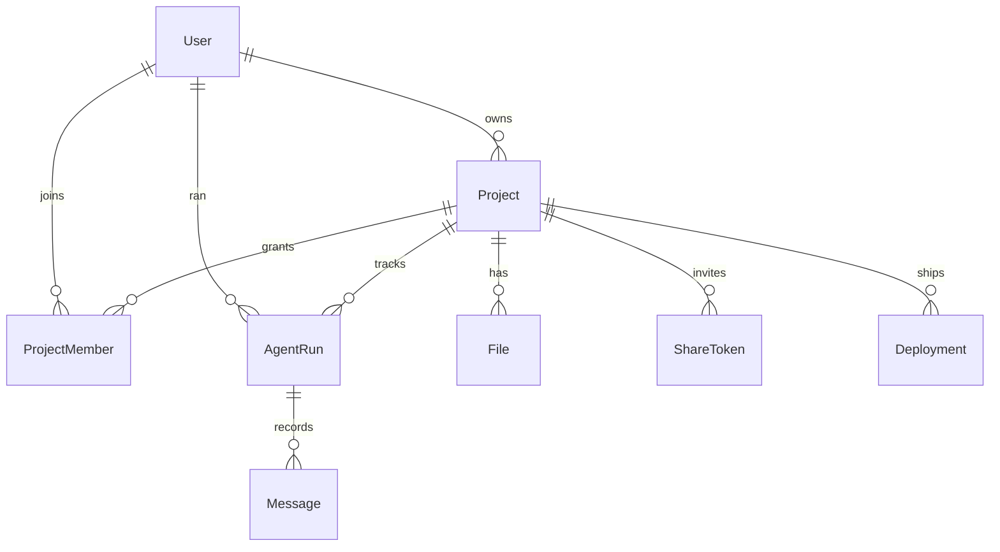

# Agentic Software Platform

> A web-based IDE where you and AI agents build full-stack applications together by describing them in plain English. Code is synthesized, edited, and run sandboxed in your browser — collaboratively, in real time.

[](https://github.com/Jenil133/Agentic-Software-Platform)
[](#license)


---

## Table of Contents

- [What it is](#what-it-is)
- [Why it exists](#why-it-exists)
- [Feature overview](#feature-overview)
- [Architecture](#architecture)
- [Tech stack](#tech-stack)
- [Phase-by-phase build log](#phase-by-phase-build-log)
- [Getting started](#getting-started)
- [Environment variables](#environment-variables)
- [Project layout](#project-layout)
- [Data model](#data-model)
- [Agent tools](#agent-tools)
- [Collaboration model](#collaboration-model)
- [Deploy pipeline](#deploy-pipeline)
- [Scripts](#scripts)
- [Roadmap](#roadmap)
- [License](#license)

---

## What it is

Agentic Software Platform is an in-browser IDE that fuses three things into one product:

1. **A real, productive code editor** — Monaco-based, with tabs, file tree, dirty state, save shortcuts, and a live preview iframe powered by a WebContainer sandbox.
2. **An autonomous AI engineer** — a LangChain / LangGraph ReAct agent that has read/write access to your project and turns natural-language requests into code changes you watch happen live.
3. **A multiplayer surface** — a Yjs CRDT layer so multiple humans (and the agent) can edit the same files at the same time, with cursors, presence, and conflict-free merges.

You sign in with GitHub, create a project from a template, describe what you want, and watch the agent scaffold it. You can invite collaborators with a share link, see them as live cursors, and ship the result with a one-click deploy.

## Why it exists

This started as **Agent-Dev**, a portfolio project to push on the question: *what does an IDE look like when AI agents are first-class collaborators, not autocomplete sidekicks?* The answer here is "give the agent the same surfaces a human has — files, a sandbox, a chat — and watch what happens."

The repo is structured to be honest about that origin: each phase is a discrete commit so you can read the project chronologically and see how the layers stack.

## Feature overview

### Editor & workspace

- **Three-pane resizable IDE** built on `react-resizable-panels`: file tree, tabbed editor, agent chat — plus a vertical split for output and preview.
- **Monaco editor** with custom dark theme, tab bar with dirty indicators, `Cmd+S` to save, and 1.5s debounced autosave on idle.
- **File tree** with create / rename / delete, folder expansion, and click-to-open.
- **Project templates**: Blank, Node script, Express API, Vite + React.
- **Sandboxed run**: a `Run` button boots a WebContainer, mounts the project, runs `npm install`, then `npm run dev` or `start`. Output streams into the bottom panel; the preview iframe binds to the sandbox's `server-ready` URL.

### AI agent

- **GPT-4o ReAct agent** built with `@langchain/langgraph`'s `createReactAgent` and `@langchain/openai`.
- **Six project-aware tools** (Zod-typed): `list_files`, `read_file`, `write_file`, `delete_file`, `search_files`, `install_package` — each operating directly on the Prisma-backed file store and emitting structured events.
- **Streaming chat panel** with markdown bubbles, blinking caret while streaming, expandable tool-call cards (args + result), per-project running token meter, and inline error surfacing.
- **Live workspace sync**: when the agent writes/deletes/renames a file, the file tree, any open editor tabs, and the on-disk DB all update in the same frame.
- **Persistent runs**: every agent run is captured as an `AgentRun` row with its full `Message` log, so reopening the project re-hydrates the conversation.

### Collaboration

- **Yjs CRDT** with one `Y.Doc` per project; each file is a `Y.Text` inside a shared `Y.Map`.
- **`y-monaco`** binds the active editor to its `Y.Text` so concurrent edits merge without conflict.
- **`y-webrtc`** carries ops via `wss://signaling.yjs.dev` (peer-to-peer, no server). Falls back gracefully when offline; can be swapped for `y-websocket` against your own server with a single line change.
- **Awareness** broadcasts each user's name, color, image, and live cursor position. Presence avatars render in the workspace header.
- **Share links & roles**: owners mint revocable share tokens (`editor` or `viewer`). Visiting `/share/[token]` while signed in joins you as a `ProjectMember`. All file routes gate through a single `getProjectAccess` helper.
- **Connection status** indicator in the header (`live` / `connecting` / `disconnected`).

### Deploy

- **One-click deploy** popover from the workspace header. The `Deployment` row is created in `pending`, polls until `ready`, and surfaces the public URL in the popover with an "Open" link.
- The build is currently **mocked** to keep the demo self-contained — swap the `setTimeout` in `app/api/projects/[id]/deploy/route.ts` for a `fetch` against `vercel.com/api/v13/deployments` to ship for real.

---

## Architecture

```
┌──────────────────────────── Browser ────────────────────────────┐
│                                                                  │
│  Workspace UI (React, Tailwind)                                  │
│  ├── FileTree   ├── EditorTabs   ├── AgentPanel                  │
│  ├── Monaco ── y-monaco ── Y.Doc ── y-webrtc ── peers           │
│  └── PreviewPanel ── iframe ── WebContainer (Node sandbox)       │
│                                                                  │
└──────────────┬─────────────────────────────────┬─────────────────┘
               │                                 │
               │ REST + SSE                      │ y-webrtc (P2P)
               │                                 │
┌──────────────▼─────────────────────────────────▼─────────────────┐
│                  Next.js 16 (App Router, Node)                    │
│                                                                   │
│  /api/auth/*           NextAuth v5 + GitHub OAuth                 │
│  /api/projects/*       CRUD, file ops, sharing, deploy            │
│  /api/agent/run        SSE — streams agent events                 │
│  /api/agent/history    rehydrates chat per project                │
│                                                                   │
│  Auth gate: getProjectAccess(projectId, userId) → role            │
│  Agent: LangChain + LangGraph + 6 Zod-typed tools                 │
│                                                                   │
└──────────────┬───────────────────────────────────────────────────┘
               │
               │ Prisma
               │
        ┌──────▼──────┐
        │   SQLite    │  (file-based, dev). Easily swapped for
        │  prisma/    │  Postgres + pgvector for prod-grade RAG.
        │  dev.db     │
        └─────────────┘
```

### Request lifecycle examples

**Saving a file** — Editor `onChange` → debounced 1.5s → `POST /api/projects/[id]/files` → `getProjectAccess` (owner or editor?) → Prisma `upsert` → response.

**Running the agent** — Chat input → `POST /api/agent/run` → server creates `AgentRun` → builds LangGraph ReAct agent with project-bound tools → `agent.streamEvents` → SSE chunks for each token / tool start / tool end / file change → client updates chat UI and workspace state.

**Live collaboration** — User A types → Monaco fires change → `y-monaco` translates to Yjs ops → `y-webrtc` broadcasts to peers via the public signaling server → peer's `Y.Text` mutates → `y-monaco` patches their Monaco buffer → cursor positions flow through Yjs awareness in the same channel.

---

## Tech stack

| Layer            | Technology                                                              |
| ---------------- | ----------------------------------------------------------------------- |
| Framework        | Next.js 16 (App Router), React 19, TypeScript 5                         |
| Styling          | Tailwind CSS v4, `lucide-react` icons                                   |
| Editor           | Monaco (`@monaco-editor/react`)                                         |
| Layout           | `react-resizable-panels`                                                |
| AI orchestration | LangChain (`langchain`, `@langchain/core`, `@langchain/openai`)         |
| Agent runtime    | `@langchain/langgraph` — ReAct agent, streaming events                  |
| Realtime         | `yjs`, `y-monaco`, `y-webrtc`, `y-protocols`                            |
| Auth             | NextAuth v5 (`next-auth`) with `@auth/prisma-adapter`                   |
| Database         | SQLite via Prisma 5 (swap for Postgres + pgvector for prod)             |
| Sandbox          | `@webcontainer/api` (StackBlitz WebContainers, in-browser Node)         |
| Validation       | `zod`                                                                   |

---

## Phase-by-phase build log

The repo is committed in four discrete steps so the architecture stacks visibly:

| Date       | Commit          | Phase                                                        |
| ---------- | --------------- | ------------------------------------------------------------ |
| 2026-03-15 | `chore: initial`| README + .gitignore                                          |
| 2026-03-24 | `feat(phase-1)` | Foundation — Next.js scaffold, auth, DB, IDE shell, sandbox  |
| 2026-04-03 | `feat(phase-2)` | AI agent layer — LangChain agent, streaming chat, persistence|
| 2026-04-15 | `feat(phase-3)` | Collaboration — Yjs CRDTs, share links, deploy pipeline      |

### Phase 1 — Foundation

- Next.js 16 + TypeScript + Tailwind v4 + App Router scaffold.
- Prisma + SQLite with `User`, `Account`, `Session`, `Project`, `File`, `AgentRun` and the initial migration.
- NextAuth v5 with GitHub OAuth, sessions persisted via the Prisma adapter, route-protection middleware.
- Three-pane IDE at `/ide/[id]` using `react-resizable-panels`.
- Monaco editor with tabs, dirty indicators, `Cmd+S`, 1.5s debounced auto-save through REST.
- File tree with create / rename / delete and folder expansion.
- Projects list at `/projects`, new-project modal with four starter templates.
- WebContainers wired to the `Run` button (npm install + dev/start, output streaming, preview iframe).
- COOP/COEP headers on `/ide/*` for cross-origin isolation.

### Phase 2 — AI agent layer

- LangChain ReAct agent powered by GPT-4o through LangGraph.
- Six Zod-typed tools (`list_files`, `read_file`, `write_file`, `delete_file`, `search_files`, `install_package`) operating on the Prisma file store.
- Streaming SSE endpoint at `/api/agent/run` emitting `run_start`, `token`, `message_end`, `tool_start`, `tool_end`, `file_change`, `run_end`, `error`.
- New `Message` model joined to `AgentRun`; full chat history persisted per project, plus `/api/agent/history` to rehydrate the panel.
- Rebuilt agent panel: streaming markdown bubbles with caret, expandable tool-call cards, running token meter, error banner.
- Live workspace sync: when the agent writes/deletes/renames a file, file tree + open tabs + DB update in the same tick.

### Phase 3 — Collaboration & polish

- Yjs CRDTs through the IDE; `y-monaco` binding each open file to a `Y.Text` inside the project's `Y.Doc`. `y-webrtc` transport via the public yjs.dev signaling server.
- Awareness carries per-user color, name, image, and cursor position — surfaced as live cursors in Monaco and a presence avatar stack in the header.
- `ProjectMember` (owner/editor/viewer) and `ShareToken` Prisma models. `/api/projects/[id]/share` mints/revokes invite links; `/share/[token]` auto-joins the signed-in user. All file/project routes gate through a shared `getProjectAccess` helper.
- `Deployment` model + `/api/projects/[id]/deploy` (mocked Vercel build → public URL). `DeployButton` popover polls until ready.
- New marketing landing page with feature cards.

---

## Getting started

### Prerequisites

- Node.js 20+
- npm (or pnpm / yarn — the project uses npm by default)
- A GitHub OAuth app for sign-in (free, takes ~30 seconds)
- An OpenAI API key with GPT-4o access (only needed for Phase 2 features)

### Install

```bash
git clone https://github.com/Jenil133/Agentic-Software-Platform.git
cd Agentic-Software-Platform

npm install

cp .env.example .env.local
# Edit .env.local — see "Environment variables" below

npx prisma migrate dev    # creates prisma/dev.db with the schema
npm run dev
```

Open <http://localhost:3000> and sign in with GitHub. Create a project from a template, then describe what you want in the agent panel on the right.

### Setting up GitHub OAuth

1. Go to <https://github.com/settings/developers> → **OAuth Apps** → **New OAuth App**.
2. **Homepage URL**: `http://localhost:3000`
3. **Authorization callback URL**: `http://localhost:3000/api/auth/callback/github`
4. Copy the Client ID and a fresh Client Secret into `AUTH_GITHUB_ID` and `AUTH_GITHUB_SECRET` in `.env.local`.

### Generating an auth secret

```bash
openssl rand -hex 32
# Paste into AUTH_SECRET
```

---

## Environment variables

| Variable             | Required for     | Notes                                                   |
| -------------------- | ---------------- | ------------------------------------------------------- |
| `DATABASE_URL`       | Always           | Prisma connection string. Default: `file:./dev.db`.     |
| `AUTH_SECRET`        | Always           | 32-byte random hex used to sign sessions.               |
| `AUTH_URL`           | Always           | Base URL, e.g. `http://localhost:3000`.                 |
| `AUTH_GITHUB_ID`     | Sign-in          | GitHub OAuth client ID.                                 |
| `AUTH_GITHUB_SECRET` | Sign-in          | GitHub OAuth client secret.                             |
| `OPENAI_API_KEY`     | Phase 2 (agent)  | Without it, the agent panel returns a clear 500.        |

---

## Project layout

```
prisma/
  schema.prisma                # User, Project, File, AgentRun, Message,
                               # ProjectMember, ShareToken, Deployment, Account,
                               # Session, VerificationToken
  migrations/                  # init, add_messages, add_collab
  dev.db                       # gitignored

src/
  app/
    page.tsx                   # marketing landing
    signin/                    # GitHub OAuth screen
    projects/                  # list of owned + shared projects
    ide/[id]/                  # workspace page (server component)
    share/[token]/             # invite-link landing → joins as ProjectMember
    api/
      auth/[...nextauth]/      # NextAuth handlers
      projects/                # POST = create, GET = list
      projects/[id]/           # GET / DELETE
      projects/[id]/files/     # POST upsert
      projects/[id]/files/[...path]/  # PUT (rename / write), DELETE
      projects/[id]/share/     # GET tokens + members, POST mint, DELETE revoke
      projects/[id]/deploy/    # GET history, POST trigger
      agent/run/               # POST → SSE stream
      agent/history/           # GET runs + messages

  components/
    NewProjectButton.tsx       # template-picker modal
    ide/
      Workspace.tsx            # CollabProvider + WorkspaceInner shell
      FileTree.tsx             # CRUD-able file tree
      EditorTabs.tsx           # tab strip with dirty state
      MonacoEditor.tsx         # Monaco + y-monaco binding
      AgentPanel.tsx           # streaming chat UI
      OutputPanel.tsx          # logs from sandbox + agent
      PreviewPanel.tsx         # sandbox preview iframe
      ShareDialog.tsx          # token mint + member list
      DeployButton.tsx         # deploy popover with poll
      PresenceAvatars.tsx      # live peer avatars in header

  lib/
    db.ts                      # Prisma singleton
    types.ts                   # ProjectFile, FileTreeNode, EditorTab
    file-tree.ts               # buildFileTree, getFileLanguage
    templates.ts               # 4 starter project templates
    webcontainer.ts            # WebContainer boot + filesToFsTree
    access.ts                  # getProjectAccess(projectId, userId) helper
    agent/
      tools.ts                 # 6 Zod-typed agent tools
      agent.ts                 # ReAct agent factory + system prompt
      types.ts                 # AgentEvent, ChatMessage, StoredRun
    collab/
      provider.tsx             # CollabProvider, useCollab(), Yjs + y-webrtc

  auth.ts                      # NextAuth config (GitHub + Prisma adapter)
  auth-handlers.ts             # GET/POST handlers re-export
  middleware.ts                # /projects + /ide route gate
  types/next-auth.d.ts         # session.user.id typing
```

---

## Data model



- `Project.files` is the canonical file list (Prisma).
- `Y.Doc.files` is the live editing surface (Yjs in-memory). Yjs writes back to Prisma through the same `POST /api/projects/[id]/files` route that human edits use.
- `AgentRun` + `Message` capture every agent turn, including `toolName`, `toolArgs`, and `toolResult` for tool calls.
- `ProjectMember.role` is one of `owner` / `editor` / `viewer`. `getProjectAccess` is the one place that resolves it.

---

## Agent tools

The LangGraph ReAct agent is wired with six tools (`src/lib/agent/tools.ts`):

| Tool              | Purpose                                                 | Mutates? |
| ----------------- | ------------------------------------------------------- | -------- |
| `list_files`      | Returns every file path in the project                  | no       |
| `read_file`       | Returns the contents of one file (truncated at 8 KB)    | no       |
| `write_file`      | Upserts a file with full new contents                   | yes      |
| `delete_file`     | Removes a file                                          | yes      |
| `search_files`    | Case-insensitive substring grep across all files        | no       |
| `install_package` | Adds a package to `dependencies` or `devDependencies`   | yes      |

Mutating tools emit a `file_change` event that the client uses to update React state and Monaco buffers in the same render.

---

## Collaboration model

- One `Y.Doc` per project, named `agentic-platform-${projectId}` (used as the `y-webrtc` room).
- `Y.Map<Y.Text>` keyed by file path holds the live document state. The editor binds the active path's `Y.Text` via `MonacoBinding`.
- Awareness state shape:
  ```ts
  { user: { id, name, color, image }, cursor?: { path, line, column } }
  ```
- Roles enforced server-side; the client UI only hides controls for non-editors.
- Persistence is server-authoritative: Yjs ops are ephemeral; Prisma is the durable store. The auto-save loop syncs the edited buffer back to `/api/projects/[id]/files` after 1.5s of idle.

> **Production note:** swap `y-webrtc` for `y-websocket` against your own server when you need stronger consistency, offline buffering, or audit logging — the rest of the stack does not change.

---

## Deploy pipeline

- `Deployment` rows are created via `POST /api/projects/[id]/deploy`. Status flows `pending → building → ready` (or `error`).
- The `DeployButton` popover polls every 1.5s while a build is in flight and shows the live URL when it lands.
- The current implementation is a stub that returns `https://<slug>-<id>.vercel.app` after a 1.5s simulated build. Swap the `setTimeout` block for a real call to Vercel's [v13/deployments API](https://vercel.com/docs/rest-api/endpoints/deployments) to ship for real.

---

## Scripts

```bash
npm run dev              # Next.js dev server on :3000
npm run build            # production build
npm run start            # serve the production build

npm run lint             # eslint
npm run prisma:generate  # regenerate Prisma client
npm run prisma:migrate   # run migrations in dev mode
npm run prisma:studio    # open Prisma Studio at :5555
```

---

## Roadmap

Things explicitly out of scope for the 4-week build, but obvious next steps:

- [ ] Replace `y-webrtc` with a managed `y-websocket` server (Liveblocks / Partykit) for offline buffering.
- [ ] Wire the deploy endpoint to the real Vercel API.
- [ ] Add a managed Postgres + `pgvector` migration for codebase RAG (the agent currently navigates files manually).
- [ ] Multi-agent topology: planner / coder / reviewer using LangGraph supervisors.
- [ ] Inline comments anchored to Yjs relative positions.
- [ ] Per-project token budget with a hard cap.
- [ ] LangSmith tracing on agent runs.
- [ ] Playwright end-to-end suite for the IDE flows.

---

## License

TBD — currently no license is granted. If you want to use the code beyond reading, open an issue.
